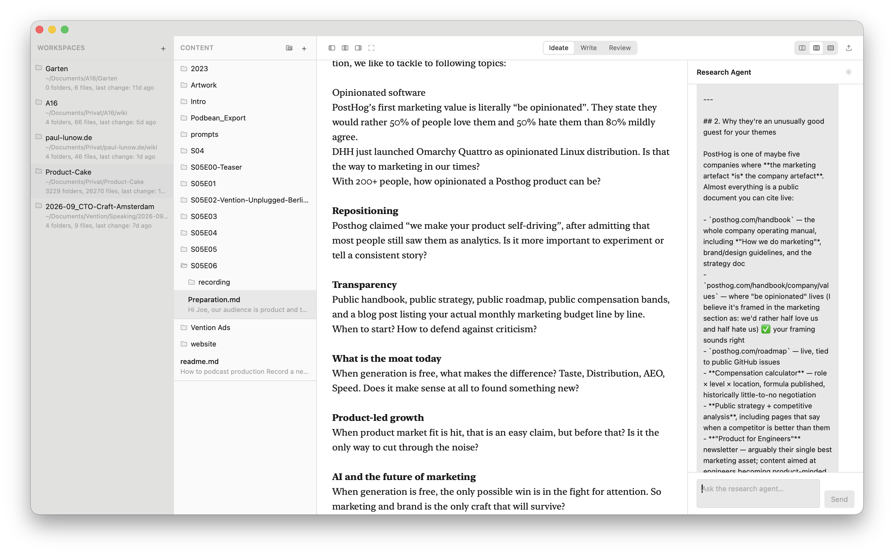
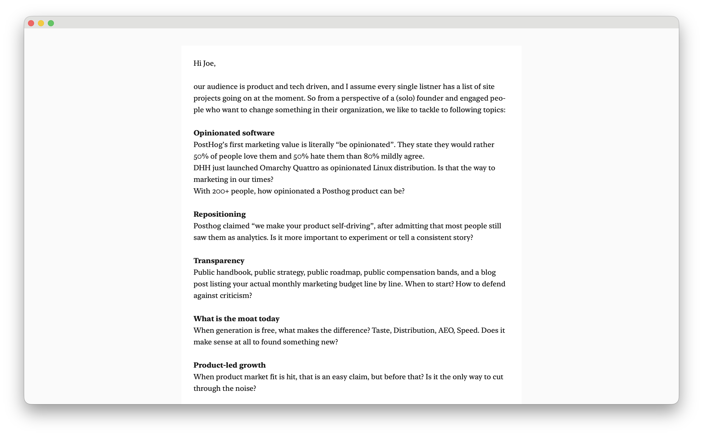
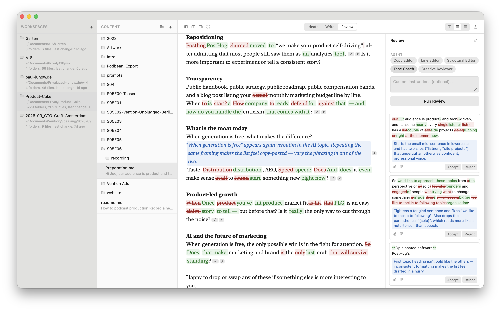

# Brain

Brain is the most beautiful way to access a bunch of markdown files.

Is it an LLM wiki, or your personal information collection? Both, really — Brain is a desktop
app (Tauri + React) that turns a folder of markdown files into a fast, keyboard-first writing
and thinking environment, with AI woven in where it actually helps instead of everywhere at once.

It's highly opinionated by [Paul](https://paul-lunow.de) — built around one workflow: **Ideate →
Write → Review**, on top of your own files, in your own workspaces.

**[⬇ Download Brain v4 for macOS (Apple Silicon + Intel)](https://github.com/lunow/Brain/releases/download/v4/Brain_4.0.0_universal.dmg)**

Signed and notarized by Apple — open the DMG, drag Brain into Applications, done.

**Command line.** Brain ships a `brain` launcher inside the app bundle. Link it into your
`PATH` once:

```bash
ln -s /Applications/Brain.app/Contents/Resources/bin/brain /usr/local/bin/brain
```

Then `brain ~/notes` opens (or switches to) that folder as a workspace, and `brain` alone just
opens the app. If Brain is already running, the folder is handed to the running instance.

## Functionality

**Workspaces & files.** Point Brain at any folder on disk and it becomes a workspace — a plain
tree of markdown files, no proprietary format, no lock-in. Add as many workspaces as you like
and switch between them instantly.

**Three writing modes**, switchable per file with `⌘1` / `⌘2` / `⌘3`:

- **Ideate** — a research agent sits next to your draft, chats about angles, open questions,
  and sources, grounded in the file you're actually working on.

  

- **Write** — a clean, distraction-free markdown editor for getting the draft down.

  

- **Review** — run your draft past specialized AI agents (Copy Editor, Line Editor, Structural
  Editor, Tone Coach, Creative Reviewer), each with a narrow focus. Suggestions come back as
  inline edits and hints you accept or reject one at a time.

  

**Command palette** (`⌘K`) — jump to any file or action without leaving the keyboard.

## Shortcuts

| Shortcut | Action |
| --- | --- |
| `⌘K` | Open command palette |
| `⌘N` | New file |
| `⌘⇧N` | New folder |
| `⌘W` | Close file |
| `⌘⇧R` | Rename the selected file (or folder) — double-clicking a name works too |
| `⌘1` / `⌘2` / `⌘3` | Switch to Ideate / Write / Review mode |
| `⌘⇧1` / `⌘⇧2` / `⌘⇧3` | Set editor width: narrow / normal / full |
| `⌘D` | Toggle the workspace/folder tree |
| `⌘⇧D` | Toggle the file list column |
| `⌘J` | Toggle the right sidebar |
| `⌘⇧F` | Toggle fullscreen |
| `⌘+` / `⌘-` / `⌘0` | Increase / decrease / reset app font scale |

## Development

```bash
pnpm install
pnpm tauri dev   # run the desktop app
pnpm test        # run the test suite
```
